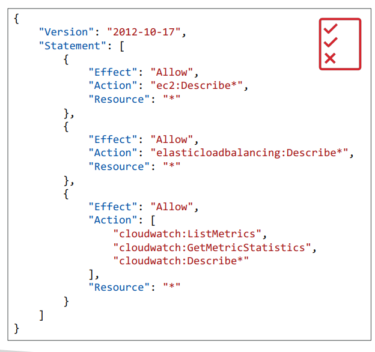
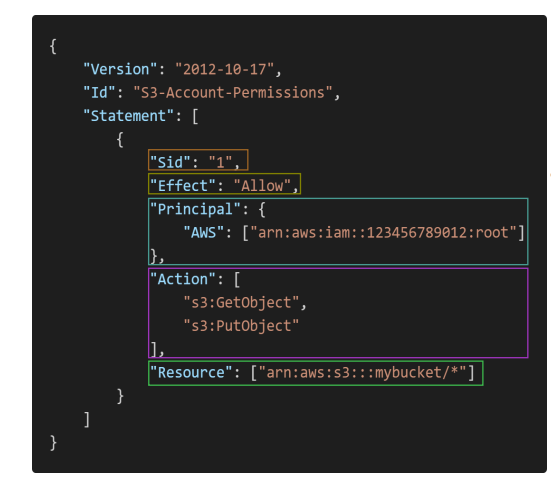

# IAM: Permissions

## Overview

- **Users or Groups** can be assigned JSON documents called policies
- These policies define the **permissions** of the users
- In AWS you apply the **least privilege principle**: don’t give more permissions than a user needs

## IAM Policies Structure

- Consists of
  - Version: policy language version, always include “2012-10-17”
  - Id: an identifier for the policy (optional) • Statement: one or more individual statements (required)
  - Statement: one or more individual statements (required)

- Statements consists of
  - Sid: an identifier for the statement (optional)
  - Effect: whether the statement allows or denies access (Allow, Deny)
  - Principal: account/user/role to which this policy applied to
  - Action: list of actions this policy allows or denies
  - Resource: list of resources to which the actions applied to
  - Condition: conditions for when this policy is in effect (optional)

## IAM – Password Policy

- Strong passwords = higher security for your account
- In AWS, you can setup a password policy:
  - Set a minimum password length
  - Require specific character types:
    - including uppercase letters
    - lowercase letters
    - numbers
    - non-alphanumeric characters
  - Allow all IAM users to change their own passwords
  - Require users to change their password after some time (password expiration)
  - Prevent password re-use

## Multi Factor Authentication - MFA

- Users have access to your account and can possibly change configurations or delete resources in your AWS account
- **You want to protect your Root Accounts and IAM users**
- MFA = password you know + security device *you own*
- **Main benefit of MFA**
  - ***if a password is stolen or hacked, the account is not compromised***
