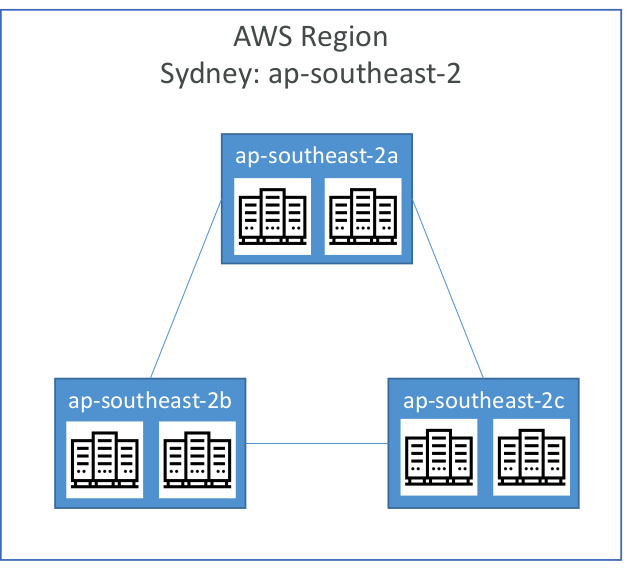

# AWS Availability Zones

## Overview

- Each region has many availability zones
(usually 3, min is 3, max is 6). Example:
  - ap-southeast-2a
  - ap-southeast-2b
  - ap-southeast-2c
  - 
- Each availability zone (AZ) is one or more discrete data centers with redundant power, networking, and connectivity
- They’re separate from each other, so that they’re isolated from disasters
- They’re connected with high bandwidth, ultra-low latency networking

## Previous lecture: [AWS Regions](aws-regions.md)

## Next lecture: [AWS Points of Presence (Edge Locations)](points-presence.md)
