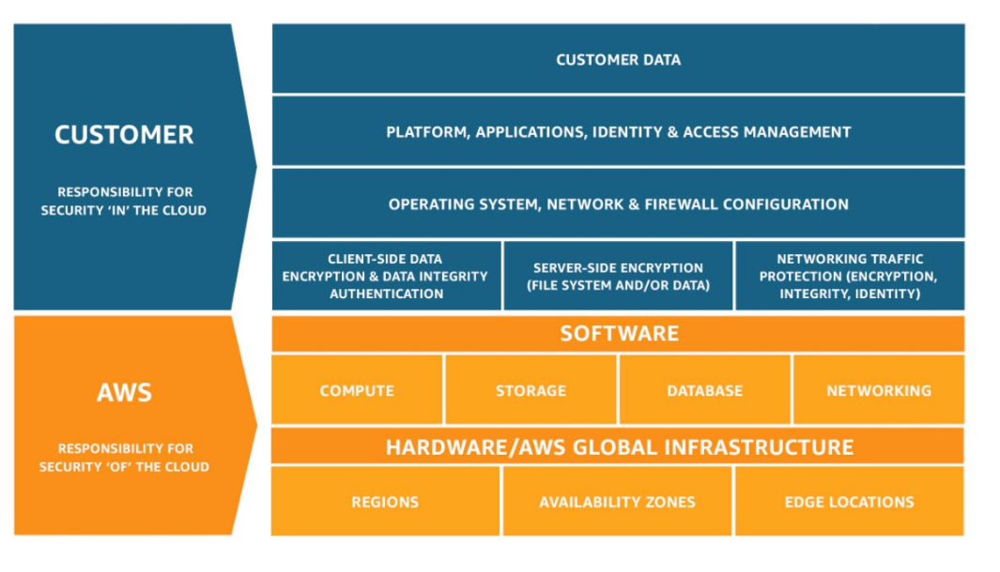

# Shared Responsibility Model diagram

## Overview

- CUSTOMER = RESPONSIBILITY FOR THE SECURITY **IN** THE CLOUD
- AWS = RESPONSIBILITY FOR THE SECURITY **OF** THE CLOUD

## Previous lecture: [Tour of the AWS Console](tour-of-aws-console.md)

## Next lecture: [AWS Acceptable Use Policy](use-policy.md)
